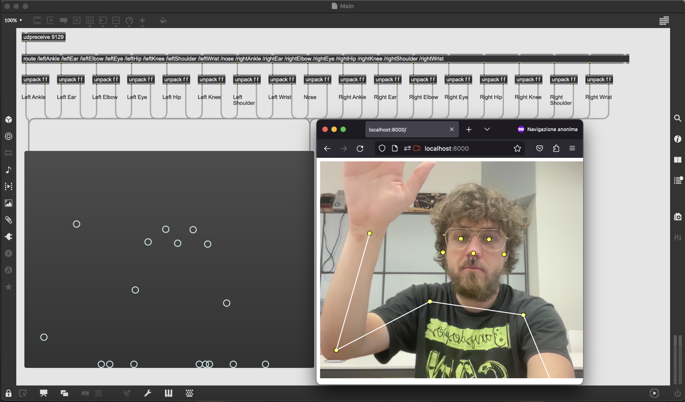

# 🏃‍♀️PoseNetOSC 📡



You need Node.js to run this tool

```shell
cd PoseNetOSC 

npm install 
```

- open Main.maxpat

- Go to localhost:8000 in the web Browser

You're now receiving all the OSC messages of the 17 keypoints through the port number 9129
